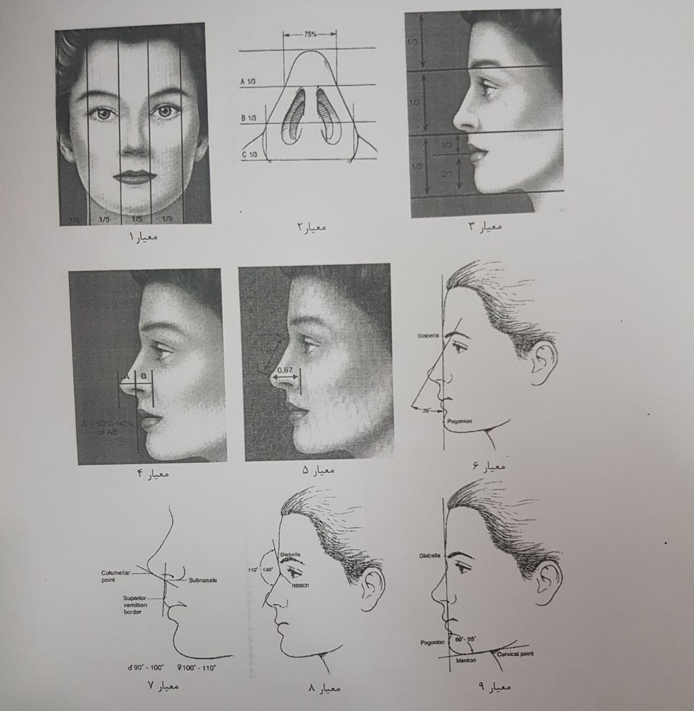

# Face Beauty Scoring and Plastic Surgery Improvement Prediction

This project is a computer vision pipeline that uses machine learning to score the beauty of a face and predict improvements after plastic surgery. The pipeline uses 3D face alignment, landmark detection, and various criteria to evaluate facial features and proportions.
Overview

## Overview

The pipeline uses a two-pronged approach to evaluate facial aesthetics:

1. Qualitative Score: An AI model, based on the VGG16 architecture, is trained to predict a qualitative score for facial beauty. This score represents the aesthetic appeal of a face as perceived by the model.

2. Quantitative Score: A separate AI model, also based on VGG16, is used to detect key points on the face. These key points are then used to evaluate the face based on 9 specific criteria. The evaluation results in a quantitative score that represents the aesthetic appeal of the face based on these criteria.

The pipeline then combines these two scores to provide a unified pre-surgery and post-surgery score. It also calculates the improvement in aesthetics made by the surgery.

The pipeline consists of several steps:

1. Face Alignment and Landmark Detection: The pipeline uses the face_alignment library to detect facial landmarks in 3D. This is done for three views of the face: left, right, and front. The code for this can be found in `explore.py` and `detect_landmarks.py`.

2. Landmark Merging and Transformation: The detected landmarks from the three views are merged and transformed to coincide with each other. This is done to create a unified representation of the face. The code for this can be found in `explore.py`.

3. Feature Evaluation: The pipeline uses various criteria to evaluate facial features and proportions. These criteria are defined in crits.py and include measurements such as the distance between the eyes, the width of the nose, and the angle of the eyebrows.

4. Beauty Scoring: The pipeline scores the beauty of the face based on the evaluated features. The scoring is done using predefined thresholds for each criterion. The code for this can be found in `crits.py`.

5. Improvement Prediction: The pipeline can also predict the improvements in beauty score after plastic surgery. This is done by comparing the beauty scores before and after surgery. he code for this can be found in `quality_score.py`.

    **Model Training**

    The `model_for_beautiful_face.ipynb` is a Jupyter notebook that trains a model based on VGG16 to predict the improvements score after surgery. It uses Keras for model training and prediction.

## Code Structure

The codebase includes several Python scripts and CSV files:

- model_for_beautiful_face.ipynb: The main Jupyter notebook that contains the pipeline for training the model and predicting the improvement score after surgery.

- quality_score.py: This script contains functions for processing facial data, scoring the aesthetics based on table lookups and non-table results, and combining these scores.

- finalscore.py: This script reads the pre and post-surgery qualitative and quantitative scores, calculates the final scores and improvements, and writes the results to a CSV file.

- results/final_scores.csv: This CSV file contains the final scores and improvements for each face, both pre and post-surgery.

## Usage

To use the pipeline, you need to provide images of the face from three views: left, right, and front. The images should be in PNG format and named according to the following pattern: `Case#<number>_<view>_<tag>_Pa_Ro_Sc.png`, where `<number> `is the case number, `<view>` is the view (1 for front, 2 for right, 3 for left), and `<tag> `is either 'pre' for before surgery or 'post' for after surgery.

The pipeline will output the beauty score for the face and the predicted improvements after surgery. The results are saved in a CSV file.
Dependencies

The pipeline requires the following Python libraries:

- face_alignment
- skimage
- numpy
- matplotlib
- pandas

## Limitations

The pipeline assumes that the face is symmetrical and that the images are well-lit and free of occlusions. It may not work well with faces that deviate significantly from these assumptions.

## Note

This project is a fascinating exploration of how AI can be used in the field of aesthetics and plastic surgery. However, it's important to remember that beauty is highly subjective and can vary greatly across different cultures and individuals. This model provides a generalized assessment based on the data it was trained on and may not align with every individual's perception of beauty.